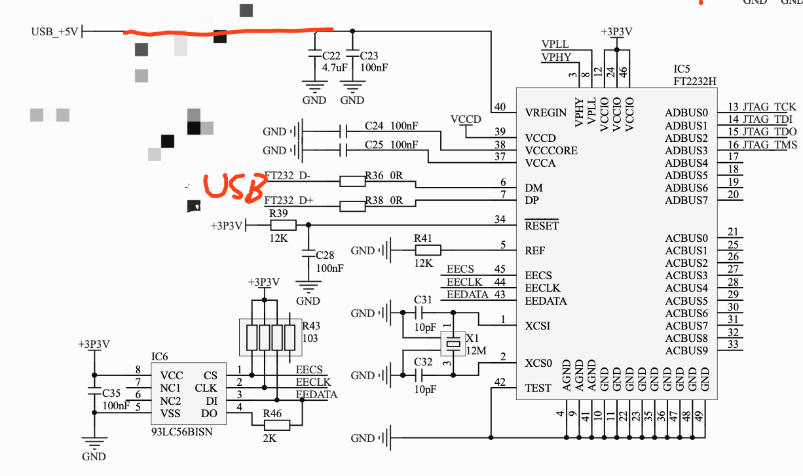

# DigilentAdept
 Xilinx FPGA调试工具 固件+原理图

# 原理图



# 烧写EEPROM（Ubuntu）

1. 下载工具

   ```bash
   sudo apt-get install libftdi1 ftdi-eeprom md5 base64
   ```

2. 一条命令烧写EEPROM文件

   ```bash
   mkdir eeprom_tmp && cd eeprom_tmp && echo -e -n 'vendor_id=0x0403\nproduct_id=0x6014\n\nflash_raw=true\n\nfilename="eeprom.bin"	# Filename, leave empty to skip file writing\n' > flash_digilent.conf && echo '8087fc049d12664b70b4d7bcb07d82f3382b832509935901699219409b833981  eeprom.bin' > eeprom.sha256sum && echo 'AQADBBRgAAmA+ggAAACgErIo2hoAAAAAAAAAAAAAVgABAMeSajVSAZAwSnRhZ0hzMQAAAAAAAAAAAABEaWdpbGVudCBKVEFHLUhTMQAAAAAAAAAAAAAAABEAAAAAAAAAAAAAAAAAAAAAAAAAAAAAAAAAAAAAAAAAAAAAAAAAAAAAAAAAAAAAAAAASAAAAAAAAAAAAAAAAAAAAAAAAAAAABIDRABpAGcAaQBsAGUAbgB0ACgDRABpAGcAaQBsAGUAbgB0ACAAVQBTAEIAIABEAGUAdgBpAGMAZQAaAzIAMQAwADUAMQAyADEAOAAwADAAOAAxAAIDAAAAAAAAAABdiw==' | base64 -d > eeprom.bin && sha256sum -c <(grep eeprom eeprom.sha256sum) && sudo ftdi_eeprom --flash-eeprom flash_digilent.conf
   ```

   注1：新买的ft2232 product一般为`0x6014`，如果执行上面的命令失败，可以使用`lsusb`查看vid是`0x0403`的USB设备的pid，把上面命令的`0x6014`换成自己的

   注2：确保电脑上只插了一个ft2232设备!!!!!!!!!!

# 参考

```base
# base64加密方式
cat digilent_jtag_uart.bin | base64
# base64解密方式
echo 'AQADBBRgAAmA+ggAAACgErIo2hoAAAAAAAAAAAAAVgABAMeSajVSAZAwSnRhZ0hzMQAAAAAAAAAAAABEaWdpbGVudCBKVEFHLUhTMQAAAAAAAAAAAAAAABEAAAAAAAAAAAAAAAAAAAAAAAAAAAAAAAAAAAAAAAAAAAAAAAAAAAAAAAAAAAAAAAAASAAAAAAAAAAAAAAAAAAAAAAAAAAAABIDRABpAGcAaQBsAGUAbgB0ACgDRABpAGcAaQBsAGUAbgB0ACAAVQBTAEIAIABEAGUAdgBpAGMAZQAaAzIAMQAwADUAMQAyADEAOAAwADAAOAAxAAIDAAAAAAAAAABdiw==' | base64 -d > eeprom.bin
# 生成sha256校验
sha256sum eeprom.bin > eeprom.sha256sum
# 使用sha256sum文件校验
sha256sum -c <(grep eeprom eeprom.sha256sum)
```

